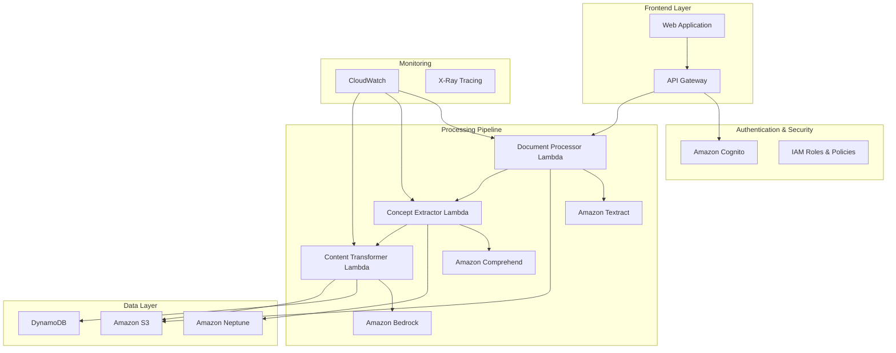

# Design Document: Adaptive Knowledge Transformation Engine (AKTE)

## Overview

The Adaptive Knowledge Transformation Engine (AKTE) is a cloud-native AI platform that transforms technical documents into personalized versions based on reader knowledge levels. The system leverages AWS services to provide scalable document processing, concept extraction, knowledge graph construction, and intelligent content transformation while preventing hallucination and maintaining factual accuracy.

### High-Level System Architecture




### Key Design Principles

1. **Preservation of Truth**: Never alter facts, definitions, equations, or formal statements
2. **Scalable Architecture**: Cloud-first design supporting millions of documents and users
3. **Personalization Without Privacy Invasion**: Effective reader modeling with minimal data collection
4. **Fail-Safe Operations**: Graceful degradation when AI components are uncertain
5. **Cost Optimization**: Efficient resource usage with automatic scaling

## Architecture

### High-Level System Architecture


### AWS Service Justification

**Amazon S3**: Document storage with versioning, lifecycle policies, and encryption
- Original documents, processed content, and transformation results
- Cost-effective storage with automatic tiering for infrequently accessed content

**AWS Lambda**: Event-driven, serverless compute for processing pipelines
- Automatic scaling based on demand
- Pay-per-execution model optimizes costs
- Stateless design enables parallel processing

**Amazon Textract**: OCR for scanned documents and PDFs
- Superior accuracy for technical documents with tables and equations
- Structured data extraction preserves document layout

**Amazon Comprehend**: Initial NLP analysis and entity recognition
- Pre-trained models for concept identification
- Custom entity recognition for domain-specific terms

**Amazon Bedrock**: LLM inference for content transformation
- Multiple model options (Claude, GPT, etc.) for different use cases
- Managed service reduces operational overhead
- Built-in safety features and content filtering

**Amazon DynamoDB**: User profiles and metadata storage
- Single-digit millisecond latency for real-time personalization
- Automatic scaling and global tables for multi-region deployment

**Amazon Neptune**: Knowledge graph storage and querying
- Optimized for graph traversal and relationship queries
- SPARQL and Gremlin support for flexible querying

**API Gateway**: RESTful API management
- Built-in throttling, caching, and monitoring
- Integration with Cognito for authentication

**Amazon Cognito**: User authentication and authorization
- Social login integration and MFA support
- JWT tokens for stateless authentication

**CloudWatch & X-Ray**: Monitoring, logging, and distributed tracing
- Real-time metrics and automated alerting
- Performance optimization and debugging support

## Components and Interfaces
### Document Processing Pipeline

#### Document Processor Component
```typescript
interface DocumentProcessor {
  processDocument(documentId: string, format: DocumentFormat): ProcessingResult
  extractStructure(content: string): DocumentStructure
  validateFormat(file: File): ValidationResult
}

interface DocumentStructure {
  sections: Section[]
  metadata: DocumentMetadata
  equations: MathematicalExpression[]
  figures: Figure[]
}
```

**Responsibilities:**
- Parse uploaded documents and extract text content
- Preserve document structure (headings, sections, lists)
- Handle multiple formats (PDF, DOCX, images)
- Coordinate with Textract for OCR processing
- Validate document integrity and format compliance

#### OCR Engine Component
```typescript
interface OCREngine {
  extractText(imageData: Buffer): OCRResult
  preserveLayout(extractedText: string, layoutInfo: LayoutData): StructuredText
  validateAccuracy(result: OCRResult): AccuracyMetrics
}

interface OCRResult {
  text: string
  confidence: number
  boundingBoxes: BoundingBox[]
  detectedLanguage: string
}
```

**Responsibilities:**
- Convert scanned documents to text using Amazon Textract
- Maintain spatial relationships and document layout
- Achieve 95%+ accuracy for technical content
- Handle mathematical notation and special characters

### Concept Extraction and Analysis

#### Concept Extractor Component
```typescript
interface ConceptExtractor {
  extractConcepts(text: string, domain: string): ConceptExtractionResult
  identifyDefinitions(text: string): Definition[]
  buildDependencyGraph(concepts: Concept[]): DependencyGraph
}

interface Concept {
  id: string
  term: string
  definition: string
  context: string
  firstMentionLocation: TextLocation
  category: ConceptCategory
  prerequisites: string[]
}
```

**Responsibilities:**
- Identify technical terms and concepts using Amazon Comprehend
- Detect formal definitions and distinguish from casual mentions
- Build prerequisite relationships between concepts
- Maintain 85%+ accuracy for concept identification
- Preserve mathematical notation without modification

#### Knowledge Graph Manager
```typescript
interface KnowledgeGraphManager {
  storeConceptGraph(graph: ConceptGraph): void
  queryPrerequisites(conceptId: string): Concept[]
  findRelatedConcepts(conceptId: string, depth: number): Concept[]
  mergeConceptsAcrossDocuments(concepts: Concept[]): ConceptGraph
}

interface ConceptGraph {
  nodes: ConceptNode[]
  edges: ConceptRelationship[]
  metadata: GraphMetadata
}
```

**Responsibilities:**
- Store concept relationships in Amazon Neptune
- Support complex graph queries for dependency analysis
- Handle concurrent updates from multiple processing operations
- Merge and consolidate concepts across documents

### Reader Profiling and Personalization

#### Reader Profiler Component
```typescript
interface ReaderProfiler {
  initializeProfile(userId: string, preferences: UserPreferences): ReaderProfile
  updateKnowledgeLevel(userId: string, interactions: UserInteraction[]): void
  assessConceptFamiliarity(userId: string, conceptId: string): FamiliarityLevel
}

interface ReaderProfile {
  userId: string
  knowledgeDomains: KnowledgeDomain[]
  conceptFamiliarity: Map<string, FamiliarityLevel>
  learningPreferences: LearningPreferences
  privacySettings: PrivacySettings
}
```

**Responsibilities:**
- Model user knowledge levels across multiple domains
- Track concept familiarity based on interaction patterns
- Support privacy-preserving personalization
- Initialize profiles with minimal user input

#### Content Transformer Component
```typescript
interface ContentTransformer {
  transformForReader(content: string, profile: ReaderProfile): TransformationResult
  injectExplanations(text: string, concepts: Concept[], profile: ReaderProfile): string
  compressKnownSections(text: string, knownConcepts: string[]): string
}

interface TransformationResult {
  transformedContent: string
  addedExplanations: Explanation[]
  preservedElements: PreservedElement[]
  confidenceScore: number
}
```

**Responsibilities:**
- Transform content based on reader knowledge level
- Inject inline explanations for unfamiliar concepts
- Compress sections covering known concepts for advanced readers
- Maintain logical flow and narrative structure
- Clearly distinguish added content from original text

### Hallucination Prevention System

#### Hallucination Validator Component
```typescript
interface HallucinationValidator {
  validateExplanation(explanation: string, sourceConcept: Concept): ValidationResult
  checkFactualAccuracy(generatedText: string, sourceContext: string): AccuracyScore
  flagUncertainContent(content: string): UncertaintyFlag[]
}

interface ValidationResult {
  isValid: boolean
  confidenceScore: number
  sources: SourceReference[]
  flags: ValidationFlag[]
}
```

**Responsibilities:**
- Verify accuracy of generated explanations against source material
- Maintain confidence scores for all generated content
- Flag content that cannot be verified against reliable sources
- Ensure mathematical and scientific content remains unaltered
- Log validation decisions for audit and improvement

## Data Models

### Document Model
```typescript
interface Document {
  id: string
  userId: string
  originalContent: string
  processedContent: ProcessedContent
  metadata: DocumentMetadata
  uploadTimestamp: Date
  processingStatus: ProcessingStatus
}

interface ProcessedContent {
  extractedText: string
  structure: DocumentStructure
  concepts: string[]
  equations: MathematicalExpression[]
}
```

### User Profile Model
```typescript
interface UserProfile {
  userId: string
  email: string
  knowledgeProfile: ReaderProfile
  subscriptionTier: SubscriptionTier
  preferences: UserPreferences
  createdAt: Date
  lastActive: Date
}
```

### Concept Graph Model
```typescript
interface ConceptNode {
  id: string
  term: string
  definition: string
  domain: string
  difficulty: DifficultyLevel
  sources: DocumentReference[]
}

interface ConceptRelationship {
  fromConceptId: string
  toConceptId: string
  relationshipType: RelationshipType
  strength: number
  source: string
}
```
## Correctness Properties

*A property is a characteristic or behavior that should hold true across all valid executions of a system—essentially, a formal statement about what the system should do. Properties serve as the bridge between human-readable specifications and machine-verifiable correctness guarantees.*

After analyzing the acceptance criteria, I've identified several key properties that can be consolidated to eliminate redundancy while maintaining comprehensive coverage:

### Property Reflection

Several properties can be combined for more comprehensive testing:
- Document processing properties (1.1, 1.3, 1.5) can be combined into a comprehensive document processing property
- Concept extraction accuracy properties (2.1, 2.5) can be merged into a single accuracy property
- Content preservation properties (1.3, 2.6, 5.4) can be consolidated into a preservation property
- Authentication and security properties (9.1, 9.2, 9.5) can be combined into comprehensive security testing

### Core Properties

**Property 1: Document Processing Integrity**
*For any* supported document format (PDF, DOCX, TXT, images), processing should extract text content while preserving document structure, mathematical equations, and formal statements exactly as they appear in the original
**Validates: Requirements 1.1, 1.3, 1.5**

**Property 2: OCR Accuracy Threshold**
*For any* scanned document processed through OCR, the text extraction accuracy should meet or exceed 95% when compared to ground truth text
**Validates: Requirements 1.2**

**Property 3: Error Handling Robustness**
*For any* invalid input or processing failure, the system should return descriptive error messages while maintaining system stability and not corrupting existing data
**Validates: Requirements 1.4**

**Property 4: Large Document Chunking**
*For any* document exceeding 50MB, processing should handle it in chunks while maintaining content coherence and completeness
**Validates: Requirements 1.6**

**Property 5: Concept Identification Accuracy**
*For any* technical document, concept extraction should identify technical terms, definitions, and key concepts with accuracy above 85% and correctly distinguish between formal definitions, examples, and casual mentions
**Validates: Requirements 2.1, 2.4, 2.5**

**Property 6: Concept Definition Tracking**
*For any* concept first introduced in a document, the system should correctly mark its definition location and context for future reference
**Validates: Requirements 2.2**

**Property 7: Prerequisite Relationship Detection**
*For any* concepts with prerequisite relationships, the system should detect and record these dependencies accurately in the knowledge graph
**Validates: Requirements 2.3**

**Property 8: Mathematical Content Preservation**
*For any* document containing mathematical notation or formal statements, these elements should remain completely unmodified throughout all processing stages
**Validates: Requirements 2.6, 5.4**

**Property 9: Knowledge Graph Storage Integrity**
*For any* extracted concepts, the knowledge graph should store them with complete relationships, metadata, and exact text preservation including source location references
**Validates: Requirements 3.1, 3.4**

**Property 10: Graph Relationship Representation**
*For any* prerequisite relationships between concepts, the knowledge graph should represent them as correctly directed edges between concept nodes
**Validates: Requirements 3.2**

**Property 11: Knowledge Graph Query Functionality**
*For any* stored concept, the system should support querying for dependencies, reverse lookups, and related concept discovery
**Validates: Requirements 3.3**

**Property 12: Concurrent Update Handling**
*For any* concurrent document processing operations, the knowledge graph should handle simultaneous updates while maintaining data consistency and integrity
**Validates: Requirements 3.5**

**Property 13: Cross-Document Concept Consolidation**
*For any* concepts appearing across multiple documents, the knowledge graph should merge and consolidate related information without losing source attribution
**Validates: Requirements 3.6**

**Property 14: Reader Profile Initialization**
*For any* new user registration, the system should initialize a complete knowledge profile with basic preferences and domain placeholders
**Validates: Requirements 4.1**

**Property 15: Profile Update from Interactions**
*For any* user interaction with transformed content, the reader profiler should update the knowledge model based on engagement patterns and demonstrated understanding
**Validates: Requirements 4.2, 4.4**

**Property 16: Concept Familiarity Tracking**
*For any* concept encountered by a user, the system should track exposure and assess comprehension level for future personalization decisions
**Validates: Requirements 4.3**

**Property 17: Multi-Domain Knowledge Support**
*For any* user profile, the system should support different expertise levels across multiple knowledge domains independently
**Validates: Requirements 4.5**

**Property 18: Privacy-Preserving Personalization**
*For any* user with privacy settings enabled, the system should maintain personalization quality while operating with minimal data collection
**Validates: Requirements 4.6**

**Property 19: Adaptive Content Transformation**
*For any* document and reader profile combination, content transformation should inject explanations for unfamiliar concepts (novice readers) or compress known sections (advanced readers) while maintaining logical flow
**Validates: Requirements 5.1, 5.2, 5.3**

**Property 20: Content Coherence Preservation**
*For any* transformed document, the result should remain coherent, readable, and maintain the original narrative structure
**Validates: Requirements 5.5**

**Property 21: Added Content Attribution**
*For any* transformation that introduces explanations, the system should clearly distinguish added content from original text
**Validates: Requirements 5.6**

**Property 22: Hallucination Validation Accuracy**
*For any* generated explanation or modification, the validator should verify accuracy against source material and established knowledge bases, flagging unverifiable content
**Validates: Requirements 6.1, 6.2**

**Property 23: Scientific Content Integrity**
*For any* mathematical or scientific content, the validator should ensure no formulas or facts are altered incorrectly during any processing stage
**Validates: Requirements 6.3**

**Property 24: Confidence Score Assignment**
*For any* generated explanation, the system should assign and maintain confidence scores, triggering appropriate fallback actions when scores fall below acceptable thresholds
**Validates: Requirements 6.4, 6.5**

**Property 25: Validation Decision Logging**
*For any* validation decision made by the hallucination validator, the system should create complete audit logs for review and improvement purposes
**Validates: Requirements 6.6**

**Property 26: Auto-Scaling Response**
*For any* increase in processing demand, the cloud infrastructure should automatically scale compute resources to maintain performance within acceptable thresholds
**Validates: Requirements 7.2**

**Property 27: Data Encryption Compliance**
*For any* user document or profile data stored or transmitted, the system should apply appropriate encryption at rest and in transit
**Validates: Requirements 7.4**

**Property 28: Backup and Recovery Operations**
*For any* backup or disaster recovery scenario, the system should execute proper procedures and restore data integrity
**Validates: Requirements 7.5**

**Property 29: Cost Optimization Automation**
*For any* situation where costs exceed budget thresholds, the system should implement automatic optimization measures
**Validates: Requirements 7.6**

**Property 30: API Functionality Completeness**
*For any* API endpoint, the system should provide proper RESTful functionality for document upload, transformation, and retrieval with correct status codes and error messages
**Validates: Requirements 8.1, 8.4**

**Property 31: API Security and Rate Limiting**
*For any* external API request, the system should authenticate requests and enforce appropriate rate limits based on user tier and system capacity
**Validates: Requirements 8.2**

**Property 32: Processing Mode Support**
*For any* API request, the system should support both synchronous and asynchronous processing modes based on request parameters and document complexity
**Validates: Requirements 8.3**

**Property 33: Large File Upload Handling**
*For any* large document upload, the API should support chunked uploads with progress tracking and proper error recovery
**Validates: Requirements 8.6**

**Property 34: Authentication Security Completeness**
*For any* user authentication attempt, the system should support secure registration, login, multi-factor authentication, and proper session management with automatic timeout
**Validates: Requirements 9.1, 9.5**

**Property 35: Access Control Enforcement**
*For any* data access attempt, the system should verify user identity and enforce appropriate permissions based on ownership and authorization levels
**Validates: Requirements 9.2**

**Property 36: Security Threat Response**
*For any* detected suspicious activity, the system should implement appropriate security measures including account protection and threat mitigation
**Validates: Requirements 9.4**

**Property 37: Complete Data Deletion**
*For any* account deletion request, the system should ensure complete data removal within specified timeframes while maintaining audit trail requirements
**Validates: Requirements 9.6**

**Property 38: Real-Time Monitoring Coverage**
*For any* system operation, the monitoring system should collect performance metrics, resource usage data, and error rates in real-time
**Validates: Requirements 10.1**

**Property 39: Automated Alert Generation**
*For any* system metric exceeding defined thresholds, the system should trigger automated alerts and appropriate response actions
**Validates: Requirements 10.2**

**Property 40: Analytics and Reporting Functionality**
*For any* system usage, the platform should collect analytics data and generate reports providing insights on transformation quality, user engagement, and system efficiency
**Validates: Requirements 10.3, 10.4**

**Property 41: Comprehensive Audit Logging**
*For any* user action or system operation, the system should maintain complete audit logs with appropriate detail levels
**Validates: Requirements 10.5**

**Property 42: Privacy-Compliant Data Handling**
*For any* data collection where privacy regulations apply, the system should anonymize or pseudonymize data appropriately while maintaining analytical value
**Validates: Requirements 10.6**
## Error Handling

### Error Classification and Response Strategy

**Document Processing Errors:**
- Invalid file formats: Return specific format requirements and supported types
- Corrupted files: Attempt partial recovery, report recoverable sections
- OCR failures: Provide confidence scores, allow manual review option
- Large file timeouts: Implement progressive processing with status updates

**Concept Extraction Errors:**
- Low confidence extractions: Flag for human review, use conservative fallbacks
- Domain mismatch: Request user confirmation of document domain
- Ambiguous relationships: Store multiple possible relationships with confidence scores
- Missing prerequisites: Allow manual prerequisite specification

**Transformation Errors:**
- Hallucination detection: Reject generated content, use original text with warnings
- Context loss: Maintain original structure, add minimal safe explanations
- Coherence failures: Fall back to original content with basic formatting improvements
- Performance degradation: Implement circuit breakers, graceful degradation

**Infrastructure Errors:**
- Service unavailability: Implement retry logic with exponential backoff
- Rate limiting: Queue requests, provide estimated processing times
- Data consistency issues: Implement eventual consistency with conflict resolution
- Security breaches: Immediate lockdown, audit trail preservation, user notification

### Error Recovery Mechanisms

**Automatic Recovery:**
- Retry failed operations with exponential backoff
- Circuit breaker pattern for external service calls
- Graceful degradation when AI services are unavailable
- Automatic failover to backup processing pipelines

**Manual Recovery:**
- Admin dashboard for monitoring and intervention
- User notification system for processing status
- Manual review queue for low-confidence operations
- Data export capabilities for user data portability

## Testing Strategy

### Dual Testing Approach

The AKTE system requires comprehensive testing combining both unit tests and property-based tests to ensure correctness across the complex AI-powered pipeline.

**Unit Testing Focus:**
- Specific examples demonstrating correct behavior for each component
- Integration points between AWS services and custom components
- Edge cases and error conditions in document processing
- Authentication and authorization workflows
- API endpoint functionality and error responses

**Property-Based Testing Focus:**
- Universal properties that hold across all document types and user profiles
- Comprehensive input coverage through randomized document generation
- Concept extraction accuracy across different domains and document structures
- Content transformation consistency across various reader profiles
- Data integrity preservation throughout the processing pipeline

### Property-Based Testing Configuration

**Testing Framework:** 
- **Python**: Use Hypothesis for property-based testing
- **TypeScript/JavaScript**: Use fast-check for property-based testing
- **Integration Tests**: Use AWS SDK mocks with property-based test data

**Test Configuration Requirements:**
- Minimum 100 iterations per property test (due to AI component variability)
- Each property test must reference its corresponding design document property
- Tag format: **Feature: adaptive-knowledge-transformation-engine, Property {number}: {property_text}**
- Seed-based reproducibility for debugging failed property tests
- Timeout handling for long-running AI operations

**Property Test Implementation:**
- Each correctness property must be implemented by a single property-based test
- Generate diverse document types, structures, and content for comprehensive coverage
- Create realistic user profiles with varying knowledge levels and domains
- Test concept graphs with different complexity levels and relationship types
- Validate transformation quality across different personalization scenarios

### Testing Data Strategy

**Document Test Corpus:**
- Synthetic documents with known concept relationships
- Real technical documents with ground truth annotations
- Edge cases: empty documents, single-concept documents, highly interconnected concepts
- Format variety: clean PDFs, scanned documents, mixed content types

**User Profile Test Data:**
- Novice profiles with minimal domain knowledge
- Expert profiles with comprehensive domain coverage
- Mixed expertise profiles across multiple domains
- Privacy-conscious profiles with minimal data sharing

**Knowledge Graph Test Scenarios:**
- Simple linear concept dependencies
- Complex multi-domain concept networks
- Circular dependency detection and handling
- Cross-document concept consolidation scenarios

### Performance and Load Testing

**Scalability Testing:**
- Document processing throughput under varying loads
- Concurrent user transformation requests
- Knowledge graph query performance with large datasets
- Auto-scaling behavior validation

**Cost Optimization Testing:**
- AWS service usage optimization under different load patterns
- Resource allocation efficiency testing
- Cost threshold breach and optimization response testing

### Security and Compliance Testing

**Security Testing:**
- Authentication and authorization boundary testing
- Data encryption validation at rest and in transit
- API security and rate limiting effectiveness
- Suspicious activity detection and response

**Compliance Testing:**
- GDPR and CCPA data handling compliance
- Data retention and deletion policy enforcement
- Audit trail completeness and integrity
- Privacy-preserving personalization validation

### Monitoring and Observability Testing

**Monitoring Validation:**
- Real-time metrics collection accuracy
- Alert generation and response automation
- Performance degradation detection
- Error rate tracking and reporting

**Analytics Testing:**
- User behavior analytics accuracy
- Transformation quality metrics validation
- System efficiency reporting correctness
- Privacy-compliant data anonymization

This comprehensive testing strategy ensures that AKTE maintains high quality, security, and performance standards while providing reliable AI-powered document transformation capabilities.